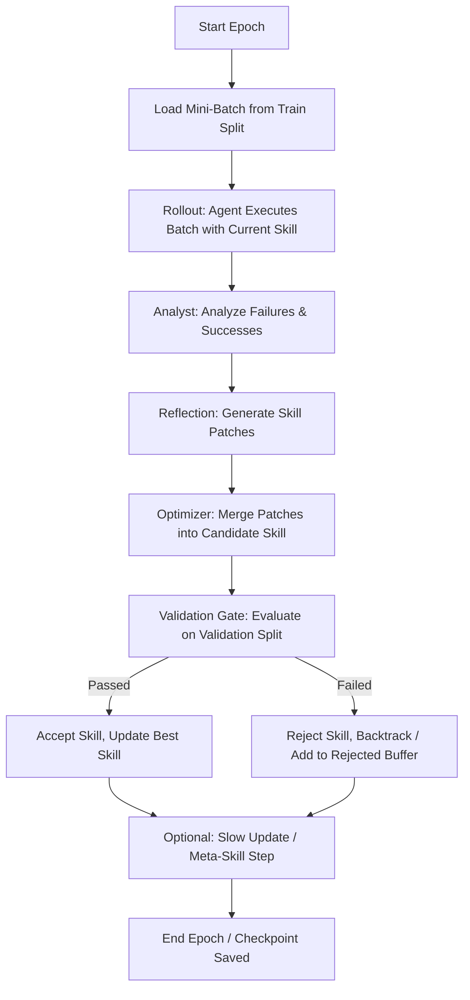

# SkillOpt Developer Reference & Skill

This skill provides comprehensive instructions, codebase structure, architecture details, and developer workflows for the **SkillOpt** repository. Activate this skill when the user requests modifications, training, evaluation, debugging, or additions to the SkillOpt project.

> [!IMPORTANT]
> If you are ever unsure about implementation details, configuration formats, or system behavior, you **MUST** refer to the official documentation and project resources at:
> *   **Official Project Page**: [https://microsoft.github.io/SkillOpt/](https://microsoft.github.io/SkillOpt/)
> *   **Research Paper (arXiv)**: [https://arxiv.org/abs/2605.23904](https://arxiv.org/abs/2605.23904)

---

## 1. Core Concepts & Academic Context

SkillOpt (published in arXiv paper `2605.23904`) is the first systematic controllable **text-space optimizer** for LLM agent instructions (skills). 

### Key Innovations:
1.  **Strict Validation Gate**: Candidate skill edits are only accepted if they strictly improve a held-out validation dataset score.
2.  **Learning Rate Budget (`edit_budget`)**: Maps to `optimizer.learning_rate`. Restricts the maximum number of bounded add/delete/replace edits made to a skill document during any single optimization turn to ensure stable learning progress.
3.  **Rejected-Edit Buffer**: Rejections of candidate skills are kept as negative feedback (negative evidence) for future steps. This prevents the optimizer model from repeating harmful directions.
4.  **Slow/Meta Updates**: Reusable textual averaging and meta-skill refinement steps run periodically to guide long-horizon behavior without adding inference-time model call overhead during deployment.

### Evaluated Performance & Transferability:
*   Beats human baselines, one-shot LLMs, TextGrad, Trace2Skill, GEPA, and EvoSkill on all 52 evaluated cells across six benchmarks, seven target models, and three execution harnesses.
*   **Average accuracy gains on GPT-5.5**:
    *   **+23.5 points** in direct chat.
    *   **+24.8 points** inside the Codex agentic execution loop.
    *   **+19.1 points** inside Claude Code.
*   **Transferability**: Skill artifacts optimized using SkillOpt transfer seamlessly across model scales (e.g., GPT-4o to GPT-5.5), between execution environments (Codex to Claude Code), and even to related task domains without further training.

---

## 2. The Reflective Training Loop (ReflACT)



---

## 3. Directory Structure & Key Components

*   `configs/`: Contains environment-specific configurations.
    *   Supports structured and flat formats.
    *   `_base_` is used for config inheritance.
*   `data/`: Directory for data splits (e.g., `train/items.json`, `val/items.json`, `test/items.json`).
*   `scripts/`: Command-line tools for running training and evaluation.
    *   `train.py`: Main entrypoint for the training loop.
    *   `eval_only.py`: Evaluates a trained skill snapshot on specified splits.
*   `skillopt/`: Core library code.
    *   `config.py`: Parser for structured/flat YAML configs with `_base_` support.
    *   `types.py`: Pydantic and typed dict mappings for rollouts, patches, and configurations.
    *   `engine/`: Contains `trainer.py` which drives the whole training and evolution pipeline.
    *   `envs/`: Benchmark adapters mapping tasks to a uniform execution interface.
        *   `base.py`: The abstract base class `EnvAdapter` that all adapters must subclass.
        *   Supported environments: `searchqa`, `alfworld`, `docvqa`, `livemathematicianbench`, `spreadsheetbench`, `officeqa`.
    *   `optimizer/`: Holds the evolutionary optimization logic:
        *   `clip.py`: Limits/filters generated patches.
        *   `lr_autonomous.py`: Controls learning rates dynamically based on gate outcomes.
        *   `rewrite.py`: Full-rewrite optimizations.
        *   `slow_update.py`: Implements slow weight/skill averaging logic.
        *   `meta_skill.py`: Performs high-level skill refinement.
    *   `prompts/`: Standard Markdown templates used for analyst reflection, patch merging, and slow updates.
*   `skillopt_webui/`: Gradio-based monitoring dashboard.

---

## 4. Environment Adapters (`skillopt/envs/base.py`)

To plug a new benchmark or environment into SkillOpt, subclass `EnvAdapter` in `skillopt/envs/base.py` and implement the following abstract methods:

```python
class EnvAdapter(ABC):
    @abstractmethod
    def build_train_env(self, batch_size: int, seed: int, **kwargs):
        """Build and return a training environment manager."""
        
    @abstractmethod
    def build_eval_env(self, env_num: int, split: str, seed: int, **kwargs):
        """Build and return an evaluation environment manager."""
        
    @abstractmethod
    def rollout(self, env_manager, skill_content: str, out_dir: str, **kwargs) -> list[dict]:
        """Run rollouts on the environment manager using the active skill content.
        
        Returns:
            list[dict]: A list of RolloutResult dicts containing:
                - "id" (str): Unique item ID
                - "hard" (0/1): Binary success indicator
                - "soft" (float 0-1): Soft metric performance
        """

    @abstractmethod
    def reflect(self, results: list[dict], skill_content: str, out_dir: str, **kwargs) -> list[dict | None]:
        """Analyze rollout failures and successes and generate edits (patches).
        
        Returns:
            list[dict | None]: Raw patch suggestions conformant to RawPatch schemas.
        """

    @abstractmethod
    def get_task_types(self) -> list[str]:
        """Return a list of task subtype names within the benchmark."""
```

### Prompt Loading Priority
Prompts are loaded using `load_prompt(name, env)` in two-level priority:
1. Environment-specific override: `skillopt/envs/<env_name>/prompts/<name>.md`
2. Fallback generic prompt: `skillopt/prompts/<name>.md`

---

## 5. Configuration System (`skillopt/config.py`)

SkillOpt supports two config structures:
1. **Structured Format (Modern)**: Organizes keys into dedicated sections: `model`, `train`, `gradient`, `optimizer`, `evaluation`, and `env`.
2. **Flat Format (Legacy)**: Backwards-compatible format with all keys at the top-level.

### Section Mappings & Key Rules
*   **Gate Validation Policy**: Gate validation is mandatory in this branch. Setting `evaluation.use_gate: false` in a structured config will trigger a `ValueError` during config flattening.
*   **Inheritance**: Config files can specify `_base_: base_config.yaml` to inherit properties recursively from a base YAML.
*   **Flattening**: The `trainer.py` expects a flat configuration. Use `flatten_config(cfg)` to translate a structured configuration dictionary into the legacy flat format.

---

## 6. Typical Developer Workflows

### Setup & Credentials
Create a `.env` file from `.env.example` containing target API endpoints and key credentials:
```bash
cp .env.example .env
# Configure Azure OpenAI / OpenAI / Anthropic key environments
```

### Training
Start training with the `scripts/train.py` wrapper:
```bash
python scripts/train.py \
    --config configs/searchqa/default.yaml \
    --split_dir data/searchqa_split \
    --azure_openai_endpoint https://your-resource.openai.azure.com/ \
    --optimizer_model gpt-5.5 \
    --target_model gpt-5.5
```
Runs are auto-resuming; executing the same command will resume training from the last completed epoch saved in `runtime_state.json`.

### Evaluation
Evaluate a trained skill document snapshot using `scripts/eval_only.py`:
```bash
python scripts/eval_only.py \
  --config configs/searchqa/default.yaml \
  --skill outputs/run_name/best_skill.md \
  --split valid_unseen \
  --split_dir data/searchqa_split
```

### WebUI Dashboard
To run the Gradio-based live training metrics and trajectory viewer:
```bash
pip install -e ".[webui]"
python -m skillopt_webui.app --port 7860
```
